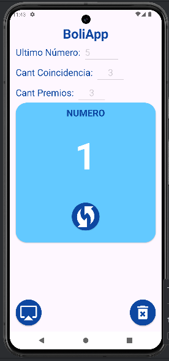
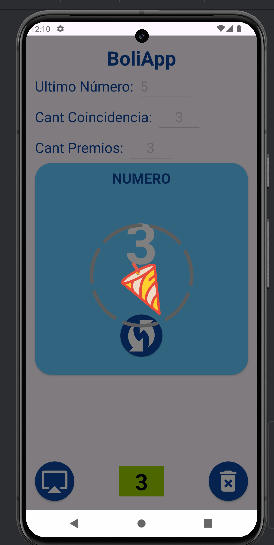
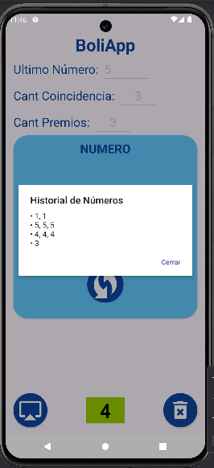

# 🎉 BoliApp - Generador de Números Aleatorios con Animaciones 🎲

**BoliApp** es una aplicación Android desarrollada en Kotlin que genera números aleatorios dentro de un rango especificado por el usuario. Incluye funcionalidades de historial, animaciones atractivas con Lottie y control de repeticiones para brindar una experiencia dinámica e interactiva.

---

## 🧠 Funcionalidades

- ✅ Generación de números aleatorios entre 1 y el valor final indicado.
- 🔁 Registro de historial de números generados.
- 🎯 Detención automática cuando un número se repite una cierta cantidad de veces.
- ✨ Animación visual usando Lottie para celebrar coincidencias y mostrar el número final.
- 🎛 Interfaz amigable y sencilla con campos de configuración de:
    - Valor máximo del número.
    - Cantidad de coincidencias para considerar un número especial.
    - Cantidad de premios a alcanzar.

---

## 🖼 Capturas de Pantalla!

  
  
  

